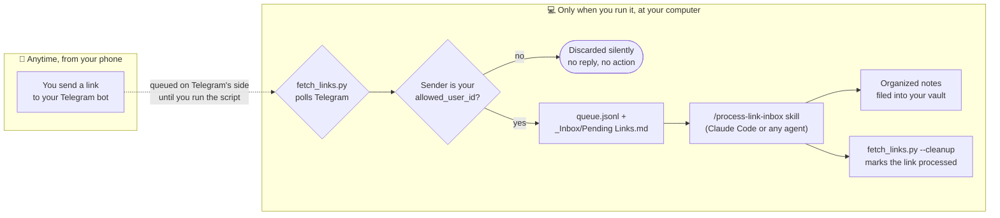

# VaultGram — Telegram → Obsidian Link Inbox


Capture interesting links from your phone via a personal Telegram bot, then
batch-process them into your Obsidian vault — on your own schedule, when
you're actually at your computer. No server, no webhook, nothing exposed to
the internet.

## Why

If you keep sending links to yourself on Telegram "to read and organize
later" and the backlog has become unmanageable, this is a small, personal
fix: a dedicated bot as the always-available capture point (your phone,
anytime, even while your PC is off for days), and a local script + an
optional [Claude Code](https://claude.com/claude-code) skill that turns the
backlog into organized notes only when you decide to run it.

## How it works



## Architecture

- **Polling, not a webhook.** `fetch_links.py` only makes outbound HTTPS
  calls to Telegram's API when you run it. No listening server, no open
  port, nothing exposed to the internet — this fits "capture anytime, process
  only when I say so" much better than a webhook would (which needs an
  always-on public endpoint). One consequence worth knowing: **the bot never
  replies in real time to anyone, not even you.** A message you send just
  sits queued on Telegram's side until you run the script — that's when you
  get the "✅ N new link(s) queued" confirmation, not the moment you hit
  send.
- **Security is an allowlist, not network isolation.** Anyone who knows your
  bot's username can message it. The real access control is in the script:
  every message whose sender isn't your `allowed_user_id` is silently
  discarded (no reply, no action). There's no exposed service to protect
  with something like a reverse-proxy/zero-trust gateway — that class of
  tool solves a different problem (protecting an inbound-facing service),
  which this design doesn't have.
- **The bot token is the only real secret.** It lives only in
  `config.local.json`, which is git-ignored and must never be committed,
  synced, or shared. If it ever leaks, revoke it instantly via BotFather
  (`/revoke`) and issue a new one.
- **Dedup.** The same link sent more than once is queued once (`pending`)
  and marked `duplicate` afterwards — never summarized twice, but still
  cleaned up from the chat.
- **Failures don't get silently deleted.** If a link's content can't be
  recovered at all, it's marked `failed`, not `processed` — and cleanup
  intentionally never deletes `failed` items from Telegram, so you always
  have a visible list of what still needs your attention (see below).

## Setup

1. On Telegram, talk to **@BotFather** → `/newbot` → pick a name and
   username → copy the **token** it gives you.
2. Copy `config.example.json` to `config.local.json` and paste the token:
   ```json
   {
     "bot_token": "YOUR_BOT_TOKEN",
     "allowed_user_id": 0,
     "vault_path": "/path/to/your/obsidian/vault"
   }
   ```
3. On Telegram, send any message (e.g. `/start`) to your new bot.
4. From a terminal (Python 3, standard library only — no `pip install`
   needed):
   ```
   python fetch_links.py --whoami
   ```
   Find your numeric `id` in the output, paste it into `config.local.json`
   as `allowed_user_id`, and set `vault_path` to your actual Obsidian vault
   folder. Save.
5. Done. From now on, send links to the bot whenever you want — they stay
   queued on Telegram's side even if your computer is off for days.

## Daily usage

- **Silent capture**: send links to the bot from your phone at any time,
  with or without a short note in the same message (e.g.
  `https://github.com/... interesting for RAG`).
- **Processing**, only when you're at your computer and want to:
  - run `python fetch_links.py` directly to refresh the queue and the
    `_Inbox/Pending Links.md` note in your vault, or
  - in Claude Code, run the `/process-link-inbox` skill, which fetches,
    reads/summarizes/files each link into the right place in your vault,
    and finally cleans up Telegram (`python fetch_links.py --cleanup`) for
    everything it successfully archived.

## Two independent pieces — and whether you need an AI agent

The project splits cleanly into two halves, and only one of them needs AI:

1. **Capture + queue** (`fetch_links.py`, the bot, `queue.jsonl`) is pure
   mechanics — polling Telegram, extracting URLs, writing JSON lines. No AI
   involved, works entirely on its own. This half alone already solves "I
   keep losing links" by turning a messy chat into an organized, append-only
   list (`_Inbox/Pending Links.md`).
2. **Processing** (reading each link, understanding what it's about,
   deciding where it belongs, writing the note) is a different kind of task:
   "read this page and write a categorized summary" isn't something plain
   code can do — it genuinely requires an LLM on the other end. There is no
   AI-free way to get this part automated. Two honest paths:
   - **Automated** — you need *some* AI agent capable of fetching pages and
     writing files against instructions. This repo ships one ready-made
     option: a Claude Code skill (below). It is not the only option — any
     other coding agent with similar tools (Cursor, Cline, Windsurf, Aider,
     ...) can follow the same instructions, since `SKILL.md` is plain text,
     not a Claude Code-proprietary format; only the `/process-link-inbox`
     trigger is Claude Code-specific. You could equally point your own
     script at any LLM API (OpenAI, the Claude API, a local model via
     Ollama) with an equivalent prompt.
   - **Manual** — no agent at all: open `Pending Links.md` and read/write
     each note yourself. Slower, but the queue still does its job of
     keeping the backlog organized and visible instead of buried in a chat.

### The Claude Code skill

This repo ships a project-scoped skill at
`.claude/skills/process-link-inbox/SKILL.md`. It's **not** installed
globally — Claude Code auto-discovers any `SKILL.md` under `.claude/skills/`
in the project folder you have open, so it's only available when you're
working inside this project (or wherever you copy that folder).

**Important**: the shipped skill uses a fictitious, illustrative filing
policy (fake folder names, fake examples) — it's a demonstration of the
pattern, not a drop-in categorization for your vault. Edit the "decide the
destination" section to describe your own vault's actual folders and
conventions before relying on it. See the example block at the bottom of
`SKILL.md`.

### Honest about content it can't read

Some platforms are effectively unreadable by a generic page fetch, and the
skill is upfront about it instead of faking a summary:

- **YouTube, TikTok**: both have a free oEmbed endpoint (no API key) that
  reliably returns title/channel/thumbnail — TikTok's caption sometimes
  counts as real content, YouTube's title alone never does.
- **LinkedIn, Facebook, Instagram**: no free metadata endpoint exists for
  these. Individual public posts are inconsistent — sometimes fully
  readable (text, comments, linked URLs), sometimes blocked outright,
  unpredictable from the URL alone — so the skill still tries a direct
  fetch first rather than assuming failure, then falls back to a web
  search, then gives up.
- **X/Twitter**: oEmbed used to be free, now returns HTTP 402 Payment
  Required.

When nothing usable comes back, the item is marked `failed`, not
`processed` — no invented summary, and (per the Security section below) its
Telegram message is deliberately never deleted, so you always know what
still needs a manual look.

### Scales as your vault grows

A log file you keep appending to (e.g. a running list of interesting repos)
isn't left to grow forever unmanaged:

- Once a log passes a rough size (roughly a couple hundred lines, or a
  year's worth of entries), the skill splits it by time period and updates
  a one-line pointer in the folder's README to the new active file — older
  files become a read-only archive, never re-read on normal runs.
- Two independent duplicate checks, so splitting a log never creates a
  blind spot: the exact same URL sent again is caught by `fetch_links.py`
  against the *entire* history of `queue.jsonl` (cheap — a flat list of
  URLs, unaffected by how vault files happen to be organized); a
  *different* URL about the same topic is caught via a compact index table
  the skill maintains in the folder's README (one row per entry ever filed,
  across every archived file) — so spotting a years-old duplicate topic
  never requires reopening an old archive.

## Queue format (`data/queue.jsonl`)

One JSON object per line:

| Field | Meaning |
|---|---|
| `id` | `"<message_id>-<index>"`, unique per link within a message |
| `message_id`, `chat_id` | Telegram identifiers, used for `--cleanup` |
| `date` | ISO timestamp of the original message |
| `url` | the captured link |
| `note` | any other text in the same message |
| `status` | `pending` \| `processed` \| `duplicate` \| `failed` |
| `destination` | (processed only) where it was filed in the vault |
| `fail_reason` | (failed only) why it couldn't be archived |
| `duplicate_of` | (duplicate only) id of the original item |
| `telegram_deleted` | true once `--cleanup` has deleted the message |

## Security

- **Bot token**: treat as a credential. Never commit `config.local.json`
  (it's git-ignored by default). Revoke and reissue via BotFather if it
  leaks.
- **Access control**: the `allowed_user_id` check in `fetch_links.py` is the
  actual security boundary — keep it, don't bypass it "just for testing".
- **No exposed surface**: polling means there's nothing listening for
  inbound connections. A reverse tunnel / zero-trust gateway in front of
  this script would protect nothing that needs protecting. If you later add
  a web dashboard to review the queue remotely, *that* would be the right
  place for something like Cloudflare Access — not here.
- **Deletion is permanent**: `--cleanup` deletes messages on both sides, no
  undo. That's why `failed` items are never touched by it — losing the only
  copy of something that was never actually archived would be worse than a
  cluttered chat.
- **Extra hardening via BotFather (recommended, defense in depth)**: `allowed_user_id`
  is what actually decides whether a message gets *acted on* — these settings
  only reduce how discoverable/reachable the bot is in the first place, they
  don't replace it. Configure them at **@BotFather → `/mybots` → select your
  bot → Bot Settings**:
  - **Inline Mode → disable.** When enabled, anyone in *any* chat can type
    `@yourbotusername query` and get a response, without ever starting a
    conversation with the bot. This project's script doesn't handle inline
    queries at all, so disabling it just removes an interaction surface you
    don't use.
  - **Allow Groups → disable.** Stops anyone from adding your bot to a
    Telegram group. Without this, the bot could end up visible to everyone
    in a group someone adds it to (the `allowed_user_id` filter would still
    discard their messages, but the bot itself would be exposed).
  - **Group Privacy Mode**: only matters if the bot can join groups — with
    "Allow Groups" disabled it has no effect either way (in one-on-one chats,
    which is all this bot ever uses, privacy mode is irrelevant regardless
    of its setting). If you ever re-enable group joining, leave this on the
    default (enabled) — disabling it makes the bot read *every* message in
    any group it's in, not just the ones addressed to it.
  - Optional extras: pick a bot username that isn't tied to your name, and
    leave `/setdescription` / `/setabouttext` blank or generic — so if
    someone does stumble onto it, it doesn't reveal what it's for.

## Requirements

- Python 3.8+, standard library only.
- A Telegram account and a bot token from @BotFather.
- An Obsidian vault (or really, any folder you want notes written into).
- Optional, only if you want automatic filing instead of doing it by hand:
  an AI coding agent — [Claude Code](https://claude.com/claude-code) with
  the included skill is the ready-made option, but any agent capable of
  fetching pages and writing files works (see above).

## License

MIT — see [LICENSE](LICENSE).

## Disclaimer

This is a personal-workflow tool shared as a working example, not a
maintained product. Fork it and adapt it to your own vault and habits.
